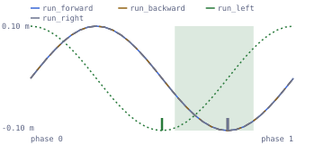

# Feet skate when clips blend

Each locomotion clip looks clean on its own, but the moment the runtime
crossfades between two of them the feet skate, stutter or pop.



Checks: [`gait-group`](../built-in-checks.md#gait-group) ·
[`sync-group`](../built-in-checks.md#sync-group) ·
[`time-complement`](../built-in-checks.md#time-complement)

## Why it happens

A directional set — run forward, back, left, right — is blended at runtime,
and a blend is only seamless when every member is at the same point in its
stride. If one cycle's left foot plants at the top of the loop and another's
plants a quarter cycle later, every mix of the two puts the feet somewhere
neither clip authored. Nothing in a single clip is wrong; the incompatibility
only exists between them, which is why it survives per-clip review.

## What AnimSmith measures

The synthetic ring below holds four clips built from one analytic gait, with
`run_left` entered a quarter of the way into that gait. The stride anchor is
measured from the left-minus-right foot height relative to the hips, so the
shift is visible as the same curve starting at a different point.



The report draws one figure per declared gait group. Every member is on the
same normalized source-phase axis and none of them is shifted onto another:
aligning them would draw one curve four times and hide the very thing the
group is checked for. `run_forward`, `run_backward` and `run_right` share one
gait, so their curves coincide and their stride-anchor marks land together at
0.75; `run_left` runs a quarter cycle earlier and its mark sits at 0.50. The
shaded band is the declared 0.15 cap either side of the circular mean of the
measured anchors, and `run_left` is the anchor outside it. No member is
nominated as the reference: the check judges the set's spread, so the figure
names the members whose anchors fall outside the band and leaves the choice of
which one to re-anchor to the project.

<iframe src="../visuals/run-ring.report.html#embed=1&finding=0" title="AnimSmith report for the four-member run-ring, scrubbed to the judged frame" width="100%" height="520" loading="lazy"></iframe>

[Open the interactive report](../visuals/run-ring.report.html) to switch
between the four members and compare their stride anchors.

## What the finding looks like

```console
$ animsmith --config examples/run-ring.animsmith.toml lint examples/assets/run-ring.glb
examples/assets/run-ring.glb:
  error[gait-group]: gait group 'run-ring': stride-anchor phases spread by 0.20 cycle (cap 0.15) — directional blends between these clips will skate or pop. Measured: [run_forward=0.75, run_backward=0.75, run_left=0.50, run_right=0.75] (measured 0.1988, expected 0.1500)
  coverage[bind-pose] insufficient_rotation_evidence ×4 (scopes: first_frame_rest_delta; subjects: run_backward, run_forward, run_left, run_right): only 0 usable first-frame rotation track(s); at least three are required
1 error(s), 0 warning(s), 0 note(s), 4 coverage gap(s), 0 available prediction facet(s), 0 required-unavailable prediction facet(s)   # exits 1
```

The finding is group-level, not per-clip: it names the ring, prints every
member's measured anchor, and identifies the one that disagrees. Linted
without the config the same file is silent — a blend ring is a runtime intent,
not something four clips reveal on their own.

## What to do

1. **Declare the ring before you debug it.** `[gait_groups.<name>]` is what
   arms the check. Until the set exists in the config, its coherence is
   unverified rather than verified-clean.
2. **Re-anchor an explicitly in-place cycle.** `animsmith transform
   --gait-anchor` rotates a cyclic clip in time so its stride anchor lands at
   t=0. Selecting it declares the clip in-place, and it refuses accumulating
   root translation or yaw.
3. **Use runtime phase offsets for root motion.** A travelling cycle keeps its
   trajectory; align the members in the blend graph instead of rewriting the
   clip.
4. **Check the timing surfaces too.** `[sync_groups.<name>]` holds same-time
   members to a shared duration, frame grid and endpoint convention, and the
   optional `time_complement` diagnostic warns when a pair aligns materially
   better under reflected time.

Who fixes it: the technical animator declares the ring, and the DCC or the
blend graph fixes the disagreement. AnimSmith can re-anchor an eligible
in-place cycle and nothing else — mask topology, contact events and graph
timing are project work. The gate closes when the declared ring lints clean
and a playback capture covers the transitions and contacts on the intended
character.

## Config

```toml
[rig]
# The stride anchor is measured from left-minus-right foot height relative to
# the hips, so the group needs hips plus both foot roles.
profile = "auto"

[gait_groups.run-ring]
clips = ["run_forward", "run_backward", "run_left", "run_right"]
# Cycle fraction: members spread wider than this skate or pop when the runtime
# crossfades between them.
max_gait_phase_spread = 0.15
# Members with less left/right alternation than this are excluded as noise.
min_lr_amplitude_m = 0.03

[sync_groups.run-ring]
clips = ["run_forward", "run_backward", "run_left", "run_right"]
max_duration_delta_s = 0.001
max_frame_count_delta = 0
max_fps_delta = 0.01

[sync_groups.run-ring.time_complement]
min_reflected_time_advantage = 0.25
min_lr_amplitude_m = 0.03
```

<details>
<summary>Precise contract: the stride anchor, gait anchoring's refusals, time-complementary pairs, and per-direction travel speed</summary>

A directional locomotion set — run forward, back, left, right — is
blended at runtime, and blending is only seamless when every member
strides in phase. If one cycle's left foot plants at t=0 and another's
at mid-cycle, every blend between them skates the feet.

The `gait-group` check holds a declared blend ring to a shared gait
phase (the stride anchor measured from the left−right foot-height
fundamental). Members with too little left/right alternation are
excluded from the spread — their phase is noise — and a member whose
gait cannot be measured at all is an error, so the group's coherence is
never silently unverified.

`transform --gait-anchor` is the matching repair-by-transform: it
rotates a cyclic clip so its stride anchor lands at t=0, aligning the
set member by member. Selecting it explicitly declares the clip in-place.
AnimSmith verifies the Root role (or Hips fallback) before rewriting and
refuses missing/non-finite evidence, horizontal endpoint displacement above 1
cm, or yaw accumulation above 1°. No interior step is subtracted as an
allowance. Every nonconstant channel the operation would rotate must contain
exactly one key at each declared whole-frame sample over the clip duration, at
the exact representable f32 `key / fps` time and period endpoint. Sparse,
differently framed, duplicate-time, or off-grid evidence refuses, as do
duplicate `(bone, property)` channels (including constant channels). Verification
samples those exact times and mutation uses an integer key-index permutation;
exempt constant-track endpoints cannot influence the period or shift. The whole
skeleton, roles, and track shapes are validated before declared frames ×
skeleton bones, declared frames × tracks, and maximum authored keys × skeleton
bones are independently bounded at an inclusive 1,000,000 samples. Yaw uses
f64 first/final headings plus counted full-turn crossings. At sample zero it
selects the local `+Z`, `+Y`, or `+X` basis axis with the greatest finite
horizontal projection, in that tie order, and retains it for the whole proof.
This accepts different source-axis conventions without switching axes later to
hide yaw; loss of the selected horizontal projection refuses. The calculation
avoids segment-count-dependent accumulation error. Four f32 successors at the
inclusive 1 cm and 1° caps cover only authored endpoint
translation/quaternion quantization. Do not apply it to
authored root motion: retain that trajectory, use
runtime phase offsets, or use a separately designed trajectory-preserving
operation. Gait anchoring does not convert root motion to in-place motion.

### A blend pair is time-complementary

A pair can be individually clean yet unsuitable for a runtime that samples
both clips at the same normalized time. One clip's left/right gait signal may
align much better with the other at one minus normalized cycle time than at
the same cycle time; blending them together then mixes different stride
moments. Unity's
[Blend Tree guidance](https://docs.unity3d.com/Manual/class-BlendTree.html)
similarly calls for blended movements and foot contacts to occur at matching
normalized times, while Godot documents explicit
[cyclic sync modes](https://docs.godotengine.org/en/stable/tutorials/animation/animation_tree.html#sync-mode)
for keeping blend-space phases aligned.

`time-complement` compares every unordered pair using the existing
left-minus-right foot-height fundamental. It reports same-time and
reflected-time similarity on `[0, 1]` (higher is closer) and warns only when
the reflected score wins by more than the configured advantage. An exact-zero
left-minus-right swing has no phase subject even when the configured floor is
zero. Positive signals below the amplitude floor are coverage gaps, not
findings: near-idle or noisy motion does not carry enough phase evidence to
classify.

This warning belongs to the declared same-time/absolute-sync contract, not to
either animation in isolation. For a declared in-place ring that satisfies the
V1 contact-topology, root-trajectory, track, and proof constraints,
[`collection transform-foot-cycle`](../collection-contracts.md#foot-cycle-generation-v1-18)
can retime every member to one explicit reference member's contact phases and
publish the independently proved generation. Unsupported rings remain
unchanged and need aligned contacts from the DCC, explicit contact/phase
markers, or a phase-remap strategy in the runtime. animsmith does not reverse
clips, choose the runtime strategy, rewrite root motion, or claim that
full-body motion is identical under time reflection.

### Directional blend members travel at different speeds

Equal cycle duration does not imply equal travel. If two root-motion members
have the same duration but different measured horizontal speeds, they cover
different distances per cycle: their authored stride lengths differ. A
diagonal faster than forward may be intentional, but a controller that assigns
one gait-wide speed or normalizes diagonal input can then produce visibly
faster diagonal travel or direction-dependent foot sliding.

Compare `animsmith measure` speed results across every declared directional
member and record the project's movement policy. Valid policies include
preserving per-direction authored velocities, scaling controller motion or
playback per member, or deliberately accepting the variation. If the project
requires uniform authored travel, re-time or re-author in the DCC and recheck
contacts, phase, and loop seams. Gait anchoring changes phase; it does not make
stride lengths coherent and must not be used to rewrite accumulating root
trajectories.

Speed variation alone is not a defect because the intended controller policy
does not live in the file. AnimSmith currently checks a clip against a declared
`speed_mps` but does not compare a runtime set against a declared cross-member
speed/stride policy; [#411](https://github.com/mmannerm/animsmith/issues/411)
tracks that evidence gap.

The checks' prerequisites, configuration keys and gap semantics are listed
with every other check in the
[built-in check reference](../built-in-checks.md#gait-group).

</details>
