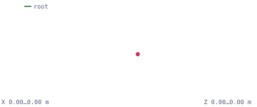
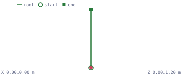

# The character glides or runs in place

The character slides across the floor without its feet driving the motion, or
it pumps its legs and never leaves the spot.


Checks: [`in-place`](../built-in-checks.md#in-place) ·
[`root-motion-speed`](../built-in-checks.md#root-motion-speed)

## Why it happens

Exactly one thing should move the character horizontally: the controller, or
the clip's own root motion. Both is a glide; neither is running in place. The
file cannot tell you which was intended — a treadmill cycle and a travelling
cycle are both valid glTF — so this symptom only becomes checkable once the
project declares who owns each movement component.

## What AnimSmith measures

The two synthetic cycles below are the same walk. One keeps its root under the
character; the other carries the hips 1.2 m forward over the same second. The
root-path figure is measured from the file, so a declared contract can be held
against it.

| In place: `walk.glb` | Travelling: `walk-travel.glb` |
|---|---|
|  |  |

<iframe src="../visuals/walk-travel.report.html#embed=1&finding=0" title="AnimSmith report for walk-travel.glb under a gameplay-owned horizontal contract" width="100%" height="520" loading="lazy"></iframe>

[Open the interactive report](../visuals/walk-travel.report.html) to read the
measured trajectory beside the finding.

## What the finding looks like

Declare that gameplay owns horizontal travel and the baked 1.2 m becomes a
glide:

```console
$ animsmith --config examples/walk-travel-in-place.animsmith.toml lint examples/assets/walk-travel.glb
examples/assets/walk-travel.glb:
  error[in-place] clip 'walk_travel': declared in-place but the root travels at 1.20 m/s — the character will glide at runtime (measured 1.2000, expected 0.0000)
  coverage[bind-pose] insufficient_rotation_evidence ×1 (scopes: first_frame_rest_delta; subjects: walk_travel): only 0 usable first-frame rotation track(s); at least three are required
1 error(s), 0 warning(s), 0 note(s), 1 coverage gap(s), 0 available prediction facet(s), 0 required-unavailable prediction facet(s)   # exits 1
```

The same file, the same measured 1.2 m/s. Declare that the animation owns the
travel and pin the speed the controller was built around, and the finding
changes to a stale pin:

```console
$ animsmith --config examples/walk-travel-root-motion.animsmith.toml lint examples/assets/walk-travel.glb
examples/assets/walk-travel.glb:
  error[root-motion-speed] clip 'walk_travel': measured root-motion speed 1.20 m/s disagrees with the declared 1.00 ± 0.10 m/s — playback scaled by this pin will slide or moonwalk (measured 1.2000, expected 1.0000)
  coverage[bind-pose] insufficient_rotation_evidence ×1 (scopes: first_frame_rest_delta; subjects: walk_travel): only 0 usable first-frame rotation track(s); at least three are required
1 error(s), 0 warning(s), 0 note(s), 1 coverage gap(s), 0 available prediction facet(s), 0 required-unavailable prediction facet(s)   # exits 1
```

With no declaration at all the same file is silent. The measurement is always
available; the contract is what makes it a finding.

## What to do

1. **Decide ownership per component, once.** XZ, Y and yaw are independent.
   Declare each as `"gameplay"` (the controller owns it) or `"animation"`
   (extracted root motion owns it), and configure the importer and controller
   to match.
2. **Get the ground truth before pinning a speed.** Run `animsmith measure`
   and read the measured horizontal root speed; a pin copied from a design
   document is the usual cause of a stale `root-motion-speed`.
3. **Re-export when the file disagrees with the decision.** AnimSmith does not
   convert root motion to in-place motion, and `transform --gait-anchor`
   refuses accumulating root translation precisely so it cannot be misused for
   that.

Who fixes it: gameplay decides ownership and the artist re-exports. AnimSmith
reports the disagreement between the declaration and the measurement, and has
no automatic movement-policy repair. The gate closes when the declaration and
the measurements agree and an engine trial proves exactly one — not zero, not
two — movement producer per component.

## Config

```toml
[rig]
# `in-place` and `root-motion-speed` need a resolvable root; both fall back
# to the hips role when the rig has no dedicated root bone.
profile = "auto"

# A treadmill cycle: the controller owns horizontal travel.
[clips.walk_travel]
movement_owner_xz = "gameplay"

# Or a travelling cycle, pinned to the speed the controller expects:
#
# [clips.walk_travel]
# movement_owner_xz = "animation"
# speed_mps = { value = 1.2, tolerance = 0.1 }
```

<details>
<summary>Precise contract: movement ownership, declared speed, and the root-role fallback</summary>

Locomotion clips carry a travel contract between the asset and the
runtime, and nothing inside the file can verify it alone.

- **Movement ownership.** Declare XZ, Y, and yaw independently as
  `"gameplay"` (the entity/controller owns that component) or `"animation"`
  (extracted root motion owns it). An in-place/treadmill clip normally uses XZ
  gameplay ownership; a travelling root-motion clip uses XZ animation
  ownership. The `in-place` check compares only declared XZ ownership against
  measured horizontal root motion. Missing axes remain unspecified and are
  never inferred from another axis, a filename, or measured magnitude.
- **Declared speed drift.** Runtimes scale playback by a clip's
  declared locomotion speed to keep foot plants locked to world
  velocity; a stale speed pin plays the clip visibly too fast or too
  slow. The `root-motion-speed` check compares the declared `speed_mps`
  against the measured horizontal root displacement. Use
  `animsmith measure` to obtain the ground-truth number before pinning
  it.

Both checks need a resolvable root: they use the rig profile's root
role, falling back to the hips role when no dedicated root bone
exists. That fallback matters in practice — the built-in `mixamo`
profile resolves `mixamorig:*` bone names but has no root role (Mixamo
rigs have no dedicated root bone), so root-motion checks on Mixamo
assets judge the hips track.

The legacy `in_place` boolean remains an XZ-only input alias (true is
gameplay, false is animation); one selector entry cannot declare both
spellings. The checks' prerequisites, configuration keys and gap semantics are
listed with every other check in the
[built-in check reference](../built-in-checks.md#in-place).

</details>
