# The file is bloated, or the retargeter chokes

Clips are far larger than the motion in them justifies, a retargeter or
importer mangles a character it should handle, or a weapon parented to a
socket imports at the wrong size.



Checks: [`constant-track`](../built-in-checks.md#constant-track) ·
[`scale-keys`](../built-in-checks.md#scale-keys) ·
[`non-uniform-scale`](../built-in-checks.md#non-uniform-scale) ·
[`rest-world-scale`](../built-in-checks.md#rest-world-scale) ·
[`constant-nonunit-scale`](../built-in-checks.md#constant-nonunit-scale)

## Why it happens

"Key everything" exports and baked control rigs write channels that store
hundreds of identical values, and every one of them still costs storage and
work in every blend the runtime evaluates. Animated and non-uniform scale come
from the same place — a constraint bake, a unit conversion, an unapplied
object transform — and are the curves retargeters and physics are least
consistent about. None of this is invalid, which is exactly why it
accumulates: the file plays, so nobody looks.

## What AnimSmith measures

The synthetic walk below stretches its pelvis to 1.2 on Y and back, and
carries a five-key `weapon_socket` translation channel that never moves. The
report separates the two facts: temporal scale variation, unequal axes, and
redundant data are three different findings about the same file.

<iframe src="../visuals/walk-scaled.report.html#embed=1&finding=0" title="AnimSmith report for walk-scaled.glb, scrubbed to the judged frame" width="100%" height="520" loading="lazy"></iframe>

[Open the interactive report](../visuals/walk-scaled.report.html) to read the
three findings against the frames they were judged at.

## What the finding looks like

These checks are mechanical, so they run with no configuration:

```console
$ animsmith lint examples/assets/walk-scaled.glb
examples/assets/walk-scaled.glb:
  warning[scale-keys] clip 'walk_scaled' bone 'pelvis': scale animation present — verify it is intentional; many rigs and retargeters mishandle animated scale
  warning[non-uniform-scale] clip 'walk_scaled' bone 'pelvis' @0.500s: non-uniform scale present — verify it is intentional; many rigs and retargeters mishandle non-uniform scale
  note[constant-track] clip 'walk_scaled' bone 'weapon_socket': translation track has 5 keys but never moves — export bloat
  coverage[bind-pose] insufficient_rotation_evidence ×1 (scopes: first_frame_rest_delta; subjects: walk_scaled): only 0 usable first-frame rotation track(s); at least three are required
0 error(s), 2 warning(s), 1 note(s), 1 coverage gap(s), 0 available prediction facet(s), 0 required-unavailable prediction facet(s)   # exits 0
```

The note is the only removable one. `transform --prune-constant-tracks` names
every channel it removes, with its original track index:

```console
$ animsmith transform examples/assets/walk-scaled.glb -o compact.glb --prune-constant-tracks
  constant-track removed 'walk_scaled': track index 3 bone 'weapon_socket' translation Linear 5 key(s)
wrote compact.glb (4 node(s), 1 clip(s), 0 mesh(es) / 0 position(s), 0 material(s))   # exits 0

$ animsmith lint compact.glb
compact.glb:
  warning[scale-keys] clip 'walk_scaled' bone 'pelvis': scale animation present — verify it is intentional; many rigs and retargeters mishandle animated scale
  warning[non-uniform-scale] clip 'walk_scaled' bone 'pelvis' @0.500s: non-uniform scale present — verify it is intentional; many rigs and retargeters mishandle non-uniform scale
  coverage[bind-pose] insufficient_rotation_evidence ×1 (scopes: first_frame_rest_delta; subjects: walk_scaled): only 0 usable first-frame rotation track(s); at least three are required
0 error(s), 2 warning(s), 0 note(s), 1 coverage gap(s), 0 available prediction facet(s), 0 required-unavailable prediction facet(s)   # exits 0
```

The two scale warnings survive on purpose. Animated scale is authored content,
not bloat, and removing it is not a mechanical decision.

## What to do

1. **Review transition coverage before pruning.** Removing a constant channel
   keeps that clip's standalone pose but makes its `(bone, property)` coverage
   sparse. Leave tracks intact when a runtime transition does not explicitly
   reset the omitted property.
2. **Decide whether the scale motion is intentional.** Squash-and-stretch, a
   visibility trick and a gameplay deformation are all legitimate; a
   constraint bake, a unit-conversion curve and an unapplied object scale are
   not. Inspect the curve in the DCC's Graph Editor and remove or rebake only
   the unwanted channel.
3. **Check what a socket actually inherits.** A node's local scale is not its
   effective scale. Declare the attachment nodes your runtime contract cares
   about in `[runtime_nodes] selectors` and let `rest-world-scale` report the
   inherited factor.
4. **Fix the source, then verify the export.** Re-export, re-lint, and preview
   in the target engine; the desired end state is that deliberate scale motion
   remains and accidental curves are gone.

Who fixes it: the artist or the exporter settings. AnimSmith can remove
provably constant multi-key tracks and nothing else — it does not judge a
non-rest constant pin, rewrite cubic tangents, flatten skeletal scale into
geometry, or decide whether an effect is artistically correct. The gate closes
when a source recheck plus the target engine's own scale, attachment and
visual observation agree.

## Config

```toml
# Shared attachment/socket/IK policy. Each exact name or `*` glob must resolve
# to exactly one source node; a miss or multiple matches is a coverage gap.
[runtime_nodes]
selectors = ["weapon_socket", "ik_*_target"]

[checks.rest-world-scale]
expected_uniform_scale = 1.0
uniform_scale_tolerance = 0.0001

# Opt into a unit-scale policy only when the project expects unit scale in
# animation channels.
[checks.constant-nonunit-scale]
severity = "note" # or "warn" / "error" for your project
```

<details>
<summary>Precise contract: constant tracks, inherited rest-world scale, the five separated scale facts, and the pruning boundary</summary>

Export hygiene problems rarely break playback outright, which is why
they accumulate:

- **Constant tracks are export bloat.** A multi-key track whose values
  never move comes from unbaked rig channels, baked controls, or "key
  everything" exports. It is harmless motion-wise but costs disk space and
  work in every blend the runtime evaluates — the `constant-track` check
  reports it as a note, and the opt-in transform can remove candidates that
  are constant within the clip. Removal preserves that clip's standalone pose
  but makes its `(bone, property)` coverage sparse; leave tracks intact when a
  runtime transition does not explicitly reset omitted properties.

### Attachment nodes and inherited rest-world scale

A node's local scale is not its effective scale. The
[glTF node hierarchy](https://registry.khronos.org/glTF/specs/2.0/glTF-2.0.html#nodes-and-hierarchy)
composes every ancestor transform, so a socket with local scale `(1,1,1)` can
still have rest-world scale `0.01` under a unit-conversion helper. Skinning may
look correct because inverse-bind matrices compensate when deforming mesh
vertices; an ordinary effect, collision shape, or weapon parented to that
socket does not automatically receive the same skinning compensation. It
usually inherits the node hierarchy, including the non-unit scale. This is the
same parent-scale failure mode described by Unity's
[Transform documentation](https://docs.unity3d.com/6000.1/Documentation/Manual/class-Transform.html#non-uniform-scaling),
although the exact runtime consequences remain engine-specific.

Declare only source nodes your runtime contract cares about. The shared policy
also supplies future engine-unit-scale evaluation; `rest-world-scale` consumes
the same resolved set:

```toml
[runtime_nodes]
selectors = ["weapon_socket", "ik_*_target"]

[checks.rest-world-scale]
expected_uniform_scale = 1.0
uniform_scale_tolerance = 0.0001
```

Each exact name or `*` glob must resolve to one named source node. A miss or
multiple matches is reported as a coverage gap, not guessed. A finding carries
an ancestor path with source indices and reports either the measured uniform
factor or the distinct non-uniform, sheared, reflected, or singular affine
class. The tolerance is inclusive for uniform factors. Unavailable/non-finite
rest evidence remains a coverage gap.

The older `[checks.rest-world-scale].node_selectors` field remains a
compatibility alias. Do not declare it together with `[runtime_nodes]`.

Fix an unintended result in the source hierarchy or exporter, then rerun lint
against the exported asset. AnimSmith does not rescale the file, decide which
node names your project uses, infer units from mesh height, or predict a
runtime's whole attachment system. Animation-channel scale remains under
`scale-keys`, `non-uniform-scale`, and `constant-nonunit-scale`; this check
judges the static inherited rest domain only.

### Why scale animation deserves its own review

A transform scale is a three-component value `(x, y, z)`. A value of
`(1, 1, 1)` preserves the authored size, a uniform value such as `(2, 2, 2)`
doubles every axis, and a non-uniform value such as `(1, 2, 1)` stretches one
axis. The [glTF animation model](https://registry.khronos.org/glTF/specs/2.0/glTF-2.0.html#animations)
allows a node's scale to be keyframed with STEP, LINEAR, or CUBICSPLINE
interpolation. Blender's
[keyframe guide](https://docs.blender.org/manual/en/latest/animation/keyframes/introduction.html)
explains the artist-facing version of the same idea: keys store property values
and interpolation curves determine every value between them.

Scale animation is not automatically invalid. It may be an intentional
squash-and-stretch effect, visibility technique, or gameplay deformation.
Unreal, for example, explicitly
[supports non-uniform scale animation](https://dev.epicgames.com/documentation/en-us/unreal-engine/non-uniform-scale-animation?application_version=4.27)
and stores scale only for animations that need it. The warning exists because
unintentional scale curves are also a common export artifact and because
runtime consequences are project- and engine-dependent. Unity documents that
[non-uniform parent scale](https://docs.unity3d.com/6000.1/Documentation/Manual/class-Transform.html#non-uniform-scaling)
can skew rotated children and disagree with some collider shapes.

animsmith separates five facts so a team can make that policy decision without
conflating them:

| Check | Literal fact | Typical source | Why review it |
|---|---|---|---|
| `scale-keys` | At least one scale component changes over time after interpolation. | Intentional squash/stretch; constraint or retarget bake; unit-conversion keys; exporter-created curves. | It can change proportions, child placement, blending, physics assumptions, and animation storage. Confirm the motion is intentional in the target engine. |
| `non-uniform-scale` | X, Y, and Z differ somewhere on the evaluated trajectory. | Stretching one bone axis; unapplied object scale; cubic interpolation overshoot between apparently harmless keys. | Parent/child hierarchies, normals, colliders, and engine components may treat non-uniform scale differently from uniform scale. |
| `constant-nonunit-scale` | A scale channel or single-key pin stays away from `(1, 1, 1)`. Disabled by default. | Unit conversion; a deliberately resized character; an unapplied static transform that survived into the rig. | Often harmless, sometimes a pipeline-policy violation. Enable it only when the project expects unit scale in animation channels. |
| `rest-world-scale` | A selected source node's inherited rest-world affine scale differs from its configured uniform policy. Quiet until node selectors are supplied. | Unit-conversion ancestor; non-uniform or reflected helper hierarchy; unapplied object scale. | Runtime attachments can inherit this scale even when inverse binds make the skinned mesh look correct. |
| `constant-track` | A multi-key track stores repeated values and never changes. | "Key everything" export, baked controls, or importer-generated constant curves. | It is redundant data even when its value is valid. Unity exposes a corresponding importer option to [remove constant scale curves](https://docs.unity3d.com/ScriptReference/ModelImporter-removeConstantScaleCurves.html). |

Examples:

- Keys `(1,1,1) → (1.1,1.1,1.1) → (1,1,1)` trigger `scale-keys` but not
  `non-uniform-scale`: the character grows uniformly and returns.
- A constant `(1,1.2,1)` channel triggers `non-uniform-scale`, and triggers
  `constant-nonunit-scale` only when that opt-in check is enabled. Multiple
  repeated keys also trigger `constant-track`.
- Dense `(1,1,1)` keys trigger `constant-track`, not `scale-keys`; there is no
  temporal scale motion.
- Equal CUBICSPLINE key values can still trigger `scale-keys` when their
  tangents move the curve between keys. Inspect the curve, not only the key
  diamonds.

To opt into a unit-scale policy:

```toml
[checks.constant-nonunit-scale]
severity = "note" # or "warn" / "error" for your project
```

### Fix the source, then verify the exported result

For an unintentional finding, inspect scale channels in the DCC's Graph Editor,
identify whether the curve belongs to a deform bone, control, helper, or object,
and remove or rebake only the unwanted channel. Check exporter options that key
all transforms or resample the FBX transform stack. Blender's
[Apply transforms](https://docs.blender.org/manual/en/latest/scene_layout/object/editing/apply.html)
can move object-level scale into object data before rigging, but its manual
explicitly warns that applying an armature object transform does not rewrite
pose animation curves or constraints. Do not treat `Ctrl-A` as a universal fix
for an already animated rig.

Re-export, rerun `animsmith lint`, and preview the result in the target engine.
The desired end state depends on intent:

- deliberate scale motion remains and is accepted by project policy;
- unnecessary dense keys are removed while the evaluated pose stays the same;
- accidental scale motion or non-uniformity is removed at its authoring source;
- a constant non-unit pin remains only when the rig/import contract requires it.

After the `constant-track` note identifies redundant multi-key data,
`transform --prune-constant-tracks` can remove flat
translation, rotation, or scale tracks (vector tolerance `1e-4`,
sign-invariant rotation tolerance `1e-3` radians). This is useful when a DCC
keys every property or bakes controls into dense holds: the resulting clip has
the same standalone modeled motion with fewer evaluated channels and less
animation data. As above, the sparser `(bone, property)` coverage can change
runtime transition behavior when omitted properties are not explicitly reset.
It prints each exact original track index so you can compare the source and
result; review transition coverage, then re-lint and preview in the target
engine.

The transform refuses candidate tracks on `animates_bones` targets, when
removal changes sampled local TRS or model-space position/rotation, or when
removal would empty the clip. Single-key pins, malformed data, and cubic tangents that create
motion above tolerance are not candidates and remain unchanged. These cases
can carry semantics AnimSmith cannot safely erase. It does not model or remove
custom curves, judge a non-rest constant pin, reduce changing keys, rewrite
cubic tangents, perform DCC cleanup, flatten skeletal scale into mesh geometry,
retarget the clip, or decide whether an effect is artistically correct. Those
operations can change deformation and must stay in the DCC or an engine-aware
retarget/import pipeline. The checks turn exported facts into a reviewable work
order; they are not general animation cleanup.

</details>
