# A limb is T-posed, or a bone never moves

One arm hangs out sideways while the rest of the body animates, a socket is
missing on the target rig, or the whole character deforms as if it were
authored on somebody else's skeleton.



Checks: [`missing-bones`](../built-in-checks.md#missing-bones) ·
[`required-bones`](../built-in-checks.md#required-bones) ·
[`frozen-bone`](../built-in-checks.md#frozen-bone) ·
[`bind-pose`](../built-in-checks.md#bind-pose)

## Why it happens

A bone can fail in four ways that all look alike in the engine: it is absent
from the skeleton, it is present but carries no keys, it carries keys that
never move it, or it moves relative to a bind pose that was not this rig's. A
presence-only check passes the third case, and a motion-only check passes a
socket that is meant to be static. What separates them is a declaration:
which bones the clip is supposed to animate, and which must simply exist.

## What AnimSmith measures

The synthetic walk below is declared to animate both arms. `arm_l` is keyed at
five identical values, and `arm_r` never reached the file at all. The report
plays back the exact frames the checks judged, so the still arm is visible in
the pose grid rather than inferred from the message.

<iframe src="../visuals/walk-frozen-arm.report.html#embed=1&finding=2" title="AnimSmith report for walk-frozen-arm.glb, scrubbed to the frozen-bone finding" width="100%" height="520" loading="lazy"></iframe>

[Open the interactive report](../visuals/walk-frozen-arm.report.html) to scrub
the cycle and watch the left arm stay where it started; it opens on the
`frozen-bone` finding that names it.

## What the finding looks like

```console
$ animsmith --config examples/walk-frozen-arm.animsmith.toml lint examples/assets/walk-frozen-arm.glb
examples/assets/walk-frozen-arm.glb:
  error[missing-bones] clip 'walk_frozen_arm' bone 'arm_r': required bone does not exist in the skeleton
  error[frozen-bone] clip 'walk_frozen_arm' bone 'arm_l': required bone rotates only 0.00° over the clip (floor 1.00°) — frozen/T-posed limb or a wrong-source slice (measured 0.0000, expected 1.0000)
  note[constant-track] clip 'walk_frozen_arm' bone 'arm_l': rotation track has 5 keys but never moves — export bloat
  coverage[bind-pose] insufficient_rotation_evidence ×1 (scopes: first_frame_rest_delta; subjects: walk_frozen_arm): only 1 usable first-frame rotation track(s); at least three are required
2 error(s), 0 warning(s), 1 note(s), 1 coverage gap(s), 0 available prediction facet(s), 0 required-unavailable prediction facet(s)   # exits 1
```

Without the declaration only the mechanical note survives. Nothing in the file
says the arms were supposed to move, so nothing in the file can be wrong about
it:

```console
$ animsmith lint examples/assets/walk-frozen-arm.glb
examples/assets/walk-frozen-arm.glb:
  note[constant-track] clip 'walk_frozen_arm' bone 'arm_l': rotation track has 5 keys but never moves — export bloat
  coverage[bind-pose] insufficient_rotation_evidence ×1 (scopes: first_frame_rest_delta; subjects: walk_frozen_arm): only 1 usable first-frame rotation track(s); at least three are required
0 error(s), 0 warning(s), 1 note(s), 1 coverage gap(s), 0 available prediction facet(s), 0 required-unavailable prediction facet(s)   # exits 0
```

## What to do

1. **Declare what the clip must animate.** `animates_bones` turns a silently
   static limb into a failing gate. It matches bone names, not rig roles, so
   it needs no profile.
2. **Declare what must merely exist.** Sockets, IK targets and mask bones are
   intentionally static, so they belong in `[rig] required_bones` rather than
   in a per-clip motion rule.
3. **Missing bone: repair the source rig.** AnimSmith does not create bones,
   rename an export, or retarget a rig. Fix the export skeleton in the DCC and
   re-export.
4. **Keyed but frozen: find the slice that dropped it.** A masked-out channel,
   a wrong-source slice, or a bake that never ran leaves keys that go nowhere.
5. **Wide bind deviation: check which rig it was authored against.** A clip
   whose first frame is far from this skeleton's rest pose was almost
   certainly authored against a different bind and will deform incorrectly
   when retargeted onto this one.

Who fixes it: the artist repairs the source rig. AnimSmith reports structural
absence, declared motion that never happened, and a first frame far from rest;
target binding, Avatar/Skeleton setup and masks are engine work. The gate
closes when a re-export meets the structural contract and the required bones
visibly move on the target character.

## Config

```toml
# Bones this clip must animate. Both checks match names, not roles.
[clips.walk_frozen_arm]
animates_bones = ["arm_l", "arm_r"]

[rig]
# Bones that must exist even though nothing is expected to move them.
required_bones = ["root", "weapon_socket", "ik_hand_l"]

[checks.frozen-bone]
# Real motion moves required bones tens of degrees; the default floor catches
# a truly static bone without flagging subtle idle sway.
min_rotation_deg = 1.0
```

<details>
<summary>Precise contract: the four rig-integrity failures, and what each one refuses to guess</summary>

Four related rig-integrity failures, in increasing subtlety:

- **A structural rig bone is absent or ambiguous.** Runtime sockets, IK
  targets, mask bones, and attachment points can be intentionally static, so
  they do not belong in a per-clip motion rule. Put their exact names in
  `[rig] required_bones = ["weapon_socket", "ik_hand_l"]`.
  `required-bones` passes a present static bone, errors for a missing name,
  and refuses to guess if duplicate skeleton names make the declaration
  ambiguous. It also reports an empty or absent skeleton as unable to meet a
  nonempty structural contract. This check does not create bones, rename an
  export, retarget a rig, or validate engine-side socket use: repair the source
  rig in the DCC and re-export.

- **A declared bone is missing entirely.** Bones the clip is declared
  to animate (via `animates_bones` in the config) must exist in the
  skeleton and carry at least one keyframed track. The `missing-bones`
  check catches slices that accidentally dropped a channel — leaving a
  limb static — and exports against the wrong rig.
- **A bone has keys but never moves.** A required bone whose rotation
  never exceeds a floor is frozen: a T-posed limb, a wrong-source
  slice, or a masked-out channel that a presence-only check would
  pass. Real motion moves required bones tens of degrees; the
  `frozen-bone` check's default 1° floor catches truly static bones
  without flagging subtle idle sway.
- **The clip was authored against a different bind.** A clip whose
  first frame deviates wildly from the skeleton's rest pose was almost
  certainly authored against a different bind — wrong seed rig, wrong
  export skeleton — and will deform incorrectly when retargeted onto
  this one. Small deviations are normal (few clips start exactly at
  rest); the `bind-pose` check fires only on a large mean deviation
  across the animated bones.

The checks' prerequisites, configuration keys and gap semantics are listed
with every other check in the
[built-in check reference](../built-in-checks.md#missing-bones).

</details>
