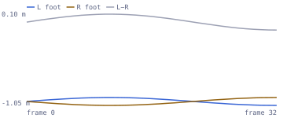
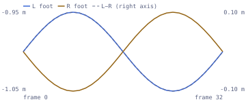

# The loop pops

Every time the cycle wraps, the character jumps or hitches for one frame.


Checks: [`loop-closure`](../built-in-checks.md#loop-closure) ·
[`loop-seam-vel`](../built-in-checks.md#loop-seam-vel) ·
[`loop-seam-rot`](../built-in-checks.md#loop-seam-rot) ·
[`loop-seam`](../built-in-checks.md#loop-seam) ·
[`duplicate-loop-endpoint`](../built-in-checks.md#duplicate-loop-endpoint)

## Why it happens

A looping clip needs the pose *and* the motion to be continuous across the
wrap. An export range that ends a frame early, an unbaked cycle modifier, or
copied endpoint keys with mismatched tangents all leave a gap that the engine
crosses in a single frame. A pose gap is a visible jump; a velocity gap is a
hitch or pulse once per cycle.

## What AnimSmith measures

The synthetic walk below was cut a quarter-cycle short. Foot height relative
to the hips no longer returns to its first-frame value, so the loop cannot
close.

| Before: `walk-dirty.glb` | After: `walk.glb` |
|---|---|
|  |  |

<iframe src="../visuals/walk-dirty.report.html#embed=1&finding=0" title="AnimSmith report for walk-dirty.glb, scrubbed to the judged seam frame" width="100%" height="520" loading="lazy"></iframe>

[Open the interactive report](../visuals/walk-dirty.report.html) to scrub the
exact frames the checks judged; the findings list on the right jumps the
viewer to the seam.

## What the finding looks like

```console
$ animsmith --config examples/walk.animsmith.toml lint examples/assets/walk-dirty.glb
examples/assets/walk-dirty.glb:
  error[loop-closure] clip 'walk' bone 'foot_r' @1.000s: loop does not close in position: bone 'foot_r' is 0.1581 m from its first-frame model-space position (cap 0.0100 m) (measured 0.1581, expected 0.0100)
  error[loop-seam] clip 'walk' @1.000s: loop seam pops: wrap discontinuity is 6.82× the neighbouring in-clip step (cap 1.60) — the clip does not close its cycle (measured 6.8152, expected 1.6000)
  error[loop-seam-vel] clip 'walk' bone 'foot_r' @1.000s: loop velocity changes at the seam: bone 'foot_r' differs by 0.7972 m/s between the incoming and outgoing model-space velocities (cap 0.1000 m/s) (measured 0.7972, expected 0.1000)
  coverage[bind-pose] insufficient_rotation_evidence ×1 (scopes: first_frame_rest_delta; subjects: walk): only 0 usable first-frame rotation track(s); at least three are required
3 error(s), 0 warning(s), 0 note(s), 1 coverage gap(s), 0 available prediction facet(s), 0 required-unavailable prediction facet(s)   # exits 1
```

The closed cycle passes the same contract. What remains is the fourth,
narrower warning: this export repeats frame 0 at the authored endpoint.

```console
$ animsmith --config examples/walk.animsmith.toml lint examples/assets/walk.glb
examples/assets/walk.glb:
  warning[duplicate-loop-endpoint] clip 'walk' @1.000s: declared loop repeats its first pose at the authored endpoint: 1 redundant closing key(s) per track; ...
  coverage[bind-pose] insufficient_rotation_evidence ×1 (scopes: first_frame_rest_delta; subjects: walk): only 0 usable first-frame rotation track(s); at least three are required
0 error(s), 1 warning(s), 0 note(s), 1 coverage gap(s), 0 available prediction facet(s), 0 required-unavailable prediction facet(s)   # exits 0
```

## What to do

1. **Nonzero position or rotation delta.** Fix the export range or the
   endpoint pose in the DCC, then re-export. AnimSmith does not re-author
   poses.
2. **Zero pose delta, high velocity delta.** Match the endpoint tangents on
   both sides of the seam in the DCC.
3. **Only a duplicated final frame.** When `duplicate-loop-endpoint` warns,
   `animsmith transform --drop-duplicate-loop-endpoint` turns the clip into an
   open cycle losslessly.

Who fixes it: the artist, in the DCC. Only a strict redundant endpoint can be
removed mechanically; pose, tangent and contact repair is DCC work, and loop
policy (which clips loop, how strict the caps are) is a project decision
recorded in the config. The gate closes when the declared closure and seam
checks pass and the loop plays cleanly in the target engine's graph.

## Config

Declare the clip as a loop; the caps below are the defaults, shown so you can
tighten or loosen them per project.

```toml
[clips.walk]
loop = true

[checks.loop-closure]
max_position_delta_m = 0.01
max_rotation_delta_deg = 1.0

[checks.loop-seam-vel]
max_velocity_delta_mps = 0.1

[checks.loop-seam-rot]
max_angular_velocity_delta_degps = 5.0
```

<details>
<summary>Precise contract: the four seam checks, model space, endpoint modes, root-motion loops and the diagnostic split</summary>

A looping clip needs both pose and motion continuity at the wrap. A pose
offset is a C0 discontinuity: the runtime jumps when it returns to frame 0. A
matching pose with mismatched incoming and outgoing velocity is a C1
discontinuity: it reaches the right point but changes direction or speed
abruptly, producing a hitch or pulse once per cycle. Unity's
[looping-clip guide](https://docs.unity3d.com/Manual/LoopingAnimationClips.html)
shows the same artist-facing start/end match problem and the special treatment
root-motion axes may need.

Animsmith separates four questions:

- `loop-closure` finds the largest last-to-first **model-space position** and
  shortest-path **model-space rotation** delta across all skeleton bones. The
  default caps are 0.01 m and 1 degree.
- `loop-seam-vel` finds the largest difference between the model-space linear
  velocity entering the last sample and leaving frame 0. Its default cap is
  0.1 m/s. A closed triangle-wave trajectory demonstrates the problem: the
  first and last position are identical, but the bone reverses direction at
  the wrap.
- `loop-seam-rot` finds the largest difference between the **shortest-path
  model-space angular velocities** entering the last sample and leaving frame
  0. Its default cap is 5 deg/s. This is rotational C1 continuity: the pose
  can close rotationally (C0) yet still snap in direction or turn rate at the
  wrap when the two seam-adjacent rotation steps disagree.
- `loop-seam` remains the locomotion-specific test. It compares feet relative
  to hips and normalizes by the neighbouring stride step, so it needs resolved
  hips/foot roles and deliberately has no result for a stationary clip.

There is a fourth, narrower warning for an export-mode problem rather than a
pose-continuity judgment: `duplicate-loop-endpoint`. Many DCC workflows export
an inclusive range or bake a cycle by copying frame 0 again at the final frame.
For a declared loop, animsmith recognizes only the mechanically certain subset:
every authored channel has one common finite, strictly increasing timeline and
valid cardinality; first and final vector components match within `1e-5` and
quaternions match within a sign-invariant `1e-4` radians; and the clip has real
interior motion. A
stationary hold is therefore not mistaken for a cycle. The warning is
default-on, needs no rig roles, and is otherwise not applicable unless
`loop = true` is declared.

That duplicate can matter to an engine that loops by advancing over the clip
duration: it evaluates or holds the same pose twice before wrapping, which can
look like a one-frame hitch. `transform --drop-duplicate-loop-endpoint` turns
only an eligible candidate into an open cycle: it atomically removes the same
complete terminal key count from every channel (and cubic-spline key triplets),
preserves retained authored data, and re-pins duration. It does not repair a
nonclosing/root-travel clip, mismatched timelines, a C1 tangent problem,
retargeting damage, or a runtime loop blend. Blender's [Cycles F-curve
modifier](https://docs.blender.org/manual/en/latest/editors/graph_editor/fcurves/modifiers.html#cycles-modifier)
and Unity's [looping-clip guide](https://docs.unity3d.com/Manual/LoopingAnimationClips.html)
are useful places to inspect the authored range and engine import behavior.

An open cycle intentionally does not keep `loop-closure` green: that existing
inclusive check compares a repeated final sample with frame 0. The
`loop_endpoint_mode` measurement distinguishes strict duplicate endpoints,
non-duplicate closing cycles, and non-closing cycles for declared loops.

The first three checks are per-bone and role independent, so idle, guard,
block, aim-offset, facial, and prop loops remain testable without a humanoid
profile or detectable stride. Model-space is intentional: a parent mismatch
can move or rotate many descendants even when their local keys match. JSON
measurements retain a stable `bone_index` plus display `bone_name` for every
row, while findings name only the maximum offending bone for each judged
dimension.

Typical causes are an export range ending one frame early, a cycle modifier or
procedural controller not being baked, copied endpoint keys whose Bezier
tangents do not match, retargeting or resampling that changes one endpoint, and
an engine importer using a different clip range from the DCC. A useful
diagnostic split is:

- nonzero position/rotation delta: repair the endpoint pose or clip range;
- zero pose delta but high velocity delta: repair the endpoint tangents or the
  seam-adjacent keys;
- closed rotational pose but high angular-velocity delta: repair the endpoint
  rotation tangents or the seam-adjacent rotation keys using the intended
  shortest turn;
- many descendants reporting the same displacement: inspect their first
  mismatching ancestor;
- only `loop-seam` failing: inspect locomotion phase and foot/hips-relative
  motion rather than a stationary pose loop.

The normal fix is in the DCC: select the intended complete cycle, bake
procedural motion, make the last pose match the first where appropriate, match
the derivative on both sides, then re-export and rerun `animsmith measure` and
`animsmith lint`.
Blender's [Cycles F-curve
modifier](https://docs.blender.org/manual/en/latest/editors/graph_editor/fcurves/modifiers.html#cycles-modifier)
can preview repeated curves, but the evaluated endpoint and tangents still
need to survive baking and export. Engine-side loop-pose blending can hide a
small mismatch at runtime; it does not make the source measurement close.

Root-motion locomotion is the important exception. Intentional horizontal root
travel does not return to its starting model-space position, and every child
inherits that travel. Tune the global `max_position_delta_m`, or the clip-level
`max_loop_position_delta_m`, to the contract; alternatively disable
`loop-closure` for such a pipeline. Keep using `loop-seam` for feet-relative
locomotion. `loop-seam-vel` and `loop-seam-rot` can still validate constant
inherited linear and angular motion respectively.

When one project contains both stationary idles and root-motion locomotion,
keep the global `[checks.loop-closure]`, `[checks.loop-seam-vel]`, and
`[checks.loop-seam-rot]` caps strict, then put a finite, non-negative
`max_loop_position_delta_m`, `max_loop_rotation_delta_deg`,
`max_loop_velocity_delta_mps`, or
`max_loop_angular_velocity_delta_degps` on the relevant `[clips."run_*"]`
family. A `[clips.run_forward]` entry wins over matching globs for only the
fields it supplies, so a one-off authored clip need not copy every inherited
value. This is a contract choice, not a repair: it does not make a
discontinuous source clip smooth.

There is no general automatic repair. `transform --gait-anchor` can rotate an
explicitly in-place locomotion cycle in time to choose a better stride cut; it
refuses accumulating root translation or yaw. Every nonconstant selected
Root/Hips trajectory channel must contain exactly one key at each declared
whole-frame sample; sparse, differently framed, duplicate-time, or off-grid
evidence refuses so the phase shift cannot synthesize values at omitted frames.
Duplicate `(bone, property)` channels refuse too. The safety grid refuses before
allocation when declared frames × skeleton bones, declared frames × tracks, or
maximum authored keys × skeleton bones exceeds 1,000,000 samples. It does not rewrite
arbitrary bone endpoint poses or tangents. Angular-velocity C1 continuity,
acceleration/jerk continuity, root-motion extraction policy, and runtime blend
settings remain out of scope.

All four checks are judged only on clips declared `loop = true` — whether a
clip is intended to loop is project knowledge — while raw measurements are
always available for measurable clips through `animsmith measure`. Workflow:
[a project contract config](../../examples/README.md#4-a-project-contract-config)
shows the same walk cycle passing clean and failing with a popped seam, and why
an undeclared loop is reported clean.

</details>
