# The pose flickers, spins, or explodes

A joint snaps the long way round between two keys, a limb jitters for a
frame, or the whole character turns into visual noise.



Checks: [`nan`](../built-in-checks.md#nan) ·
[`quat-norm`](../built-in-checks.md#quat-norm) ·
[`quat-flip`](../built-in-checks.md#quat-flip) ·
[`time-monotonic`](../built-in-checks.md#time-monotonic)

## Why it happens

Rotation is stored as quaternions, and engines are stricter about the maths
than exporters are. A key that is not unit length skews skinning, two adjacent
keys on opposite hemispheres make an engine interpolate the long way round,
and one non-finite float poisons every pose that interpolates through it.
Nothing here is an artistic decision — it is the representation of the
rotation, which is why these are the checks that need no configuration at all.

## What AnimSmith measures

The synthetic clip below carries one non-unit rotation key and one
sign-flipped key on the same bone; everything else is the clean `clip.glb`.
The report names both, with the frame each was judged at.

Both defects are in the representation rather than the pose. AnimSmith
normalizes every rotation key it samples, and a quaternion and its negation
are the same rotation, so the judged frames below play back as the clean
swing — the findings list is what marks the two defective keys. That is the
point: an engine that does not normalize, or that slerps without
neighborhood correction, is the one that flickers.

<iframe src="../visuals/clip-dirty.report.html#embed=1&finding=0" title="AnimSmith report for clip-dirty.glb, scrubbed to the judged key" width="100%" height="520" loading="lazy"></iframe>

[Open the interactive report](../visuals/clip-dirty.report.html) to scrub the
exact keys the checks judged.

## What the finding looks like

```console
$ animsmith lint examples/assets/clip-dirty.glb
examples/assets/clip-dirty.glb:
  error[quat-norm] clip 'swing' bone 'spine' @0.500s: non-unit rotation key (worst at key 2) (measured 1.0500, expected 1.0000)
  warning[quat-flip] clip 'swing' bone 'spine' @0.750s: 2 hemisphere flip(s) between adjacent rotation keys (first between keys 2 and 3) — engines without neighborhood correction will spin the long way (measured 2.0000)
  coverage[bind-pose] insufficient_rotation_evidence ×1 (scopes: first_frame_rest_delta; subjects: swing): only 1 usable first-frame rotation track(s); at least three are required
1 error(s), 1 warning(s), 0 note(s), 1 coverage gap(s), 0 available prediction facet(s), 0 required-unavailable prediction facet(s)   # exits 1
```

Both defects are lossless to repair, so this is the one symptom family
AnimSmith fixes for you. `--dry-run` reports the pending repairs and writes
nothing:

```console
$ animsmith fix examples/assets/clip-dirty.glb --dry-run
  would fix[quat-norm] clip 'swing' bone 'spine': 1 key(s) unit-normalized
1 key(s) would be fixed across 1 track(s) -> no output written
  would fix[quat-flip] clip 'swing' bone 'spine': 1 key(s) hemisphere-normalized
1 key(s) would be fixed across 1 track(s) -> no output written   # exits 1

$ animsmith fix examples/assets/clip-dirty.glb -o fixed.glb
  fixed[quat-norm] clip 'swing' bone 'spine': 1 key(s) unit-normalized
1 key(s) fixed across 1 track(s) -> fixed.glb
  fixed[quat-flip] clip 'swing' bone 'spine': 1 key(s) hemisphere-normalized
1 key(s) fixed across 1 track(s) -> fixed.glb   # exits 0

$ animsmith lint fixed.glb
fixed.glb:
  coverage[bind-pose] insufficient_rotation_evidence ×1 (scopes: first_frame_rest_delta; subjects: swing): only 1 usable first-frame rotation track(s); at least three are required
0 error(s), 0 warning(s), 0 note(s), 1 coverage gap(s), 0 available prediction facet(s), 0 required-unavailable prediction facet(s)   # exits 0
```

## What AnimSmith can do

The comparison below is that repair, run by the generator that renders this
page: the before side is `clip-dirty.glb` and the after side is the file
`animsmith fix` wrote from it, not a hand-authored clean copy of the clip.
Each side prints its own SHA-256 above the pose, which is what pins the after
side to that output — the document records both inputs by content identity and
carries no path.

<iframe src="../visuals/clip-dirty.fix.comparison.html#embed=1" title="AnimSmith comparison of clip-dirty.glb with the clip animsmith fix wrote from it" width="100%" height="640" loading="lazy"></iframe>

[Open the interactive comparison](../visuals/clip-dirty.fix.comparison.html)
and press play beside the shared phase to run both sides together, or tick
**Overlay after on before** to draw the two skeletons in one pane — the before
solid, the after dashed over it.

The findings list is what changed: the non-unit key and the hemisphere flip on
the before side, and nothing on the after side. The two pose panels play the
same swing, for the reason above — both defects were in the representation,
and AnimSmith normalizes every rotation key it samples — which is also why
[`diff` reports no measurement moved](../../examples/README.md#2-repairing-an-asset).
No rig role resolves on this three-bone chain, so the trajectory and gait
panels report their evidence unavailable: the findings and the two identities
are what this comparison has to show.

## What to do

1. **Non-unit or flipped rotation keys.** Run `animsmith fix`. The repair is
   byte-surgical: meshes, skins, materials and textures pass through
   byte-identical, and `animsmith diff` reports no measurement moved.
2. **A NaN or Inf anywhere.** There is no safe automatic repair for a value
   that carries no information. Find the step that produced it — a divide in a
   constraint, a bad bake, a corrupted transfer — and re-export.
3. **Non-monotonic or late key times.** Fix the retiming or export range in the
   DCC. A first key that starts late is its own hazard: the engine clamp-holds
   an unauthored pose for the gap.

Who fixes it: AnimSmith repairs the representation, and the DCC owns the data.
`fix` closes the two quaternion classes; a non-finite value, a broken timeline
or a bad bake goes back to the export that produced it. The gate closes when
the repaired copy re-lints clean and its `diff` against the original shows no
measurement moved.

## Config

These checks are mechanical: they run on every file with no configuration.
Configuration only changes how hard they fail — promote the hemisphere warning
for a project whose runtime slerps without neighborhood correction:

```toml
[checks.quat-flip]
severity = "error"
```

<details>
<summary>Precise contract: quaternion representation, non-finite values, key times, and what the repairs preserve</summary>

Rotation in a clip is stored as quaternions, and engines are strict
about the math even when exporters are not.

- **A non-finite value anywhere poisons everything.** A single NaN or
  Inf in a key time or value poisons interpolation and, in most
  engines, the whole pose — one bad float turns a character into
  visual noise. The `nan` check treats this as an error, always;
  there is no safe automatic repair for a value that carries no
  information.
- **Non-unit quaternions skew skinning.** Rotation keys must be unit
  quaternions. Engines renormalize inconsistently (or not at all); a
  non-unit key skews blend weights and skinning. The `quat-norm` check
  catches it, and `animsmith fix` repairs it losslessly — scaling a
  finite, non-zero quaternion back to unit length preserves the
  rotation it represents.
- **Hemisphere flips spin the long way around.** A quaternion and its
  negation represent the same rotation, but interpolation between them
  does not: adjacent keys on opposite hemispheres (`dot < 0`) make
  engines that slerp without neighborhood correction take the long way
  — a visible 360°-minus-θ spin between two keys. The `quat-flip`
  check catches it; `animsmith fix` repairs it losslessly by negating
  keys until each track is hemisphere-consistent.
- **Key times must move forward.** glTF requires strictly increasing
  key times, and engines misbehave without them. A first key that
  starts late is its own hazard: the engine clamp-holds an unauthored
  pose for the gap. The `time-monotonic` check covers both.

Workflow: [a first CLI gate](../../examples/README.md#1-a-first-cli-gate)
detects these; [repairing an
asset](../../examples/README.md#2-repairing-an-asset) walks the
`fix --dry-run` → `fix` → verify loop. The repairs are byte-surgical:
meshes, skins, materials, and textures pass through byte-identical.

The checks' prerequisites, configuration keys and gap semantics are listed
with every other check in the
[built-in check reference](../built-in-checks.md#mechanical-checks).

</details>
